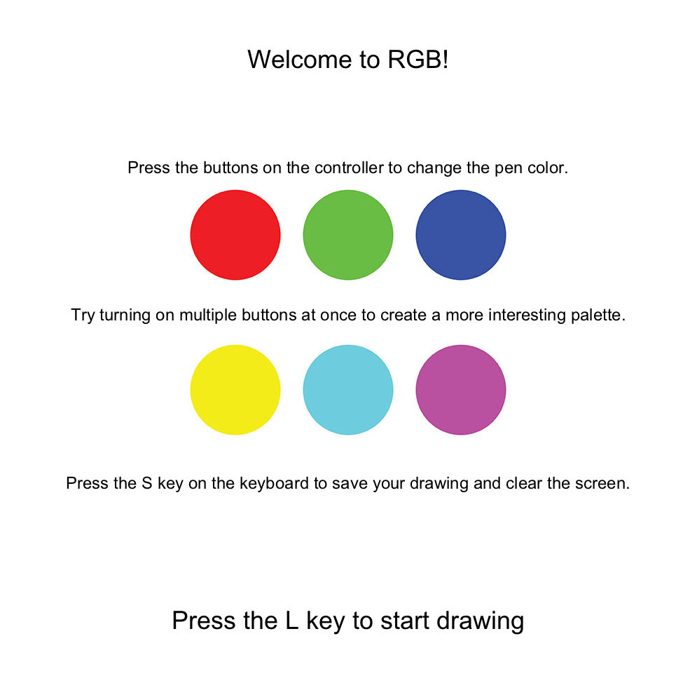
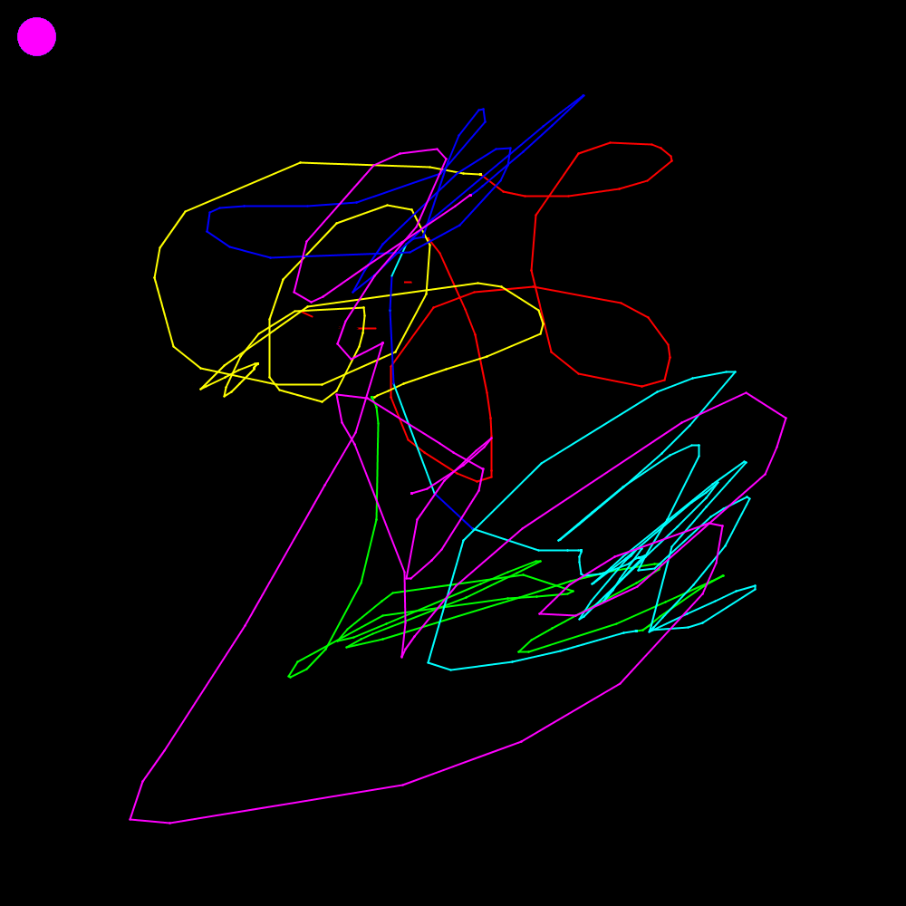
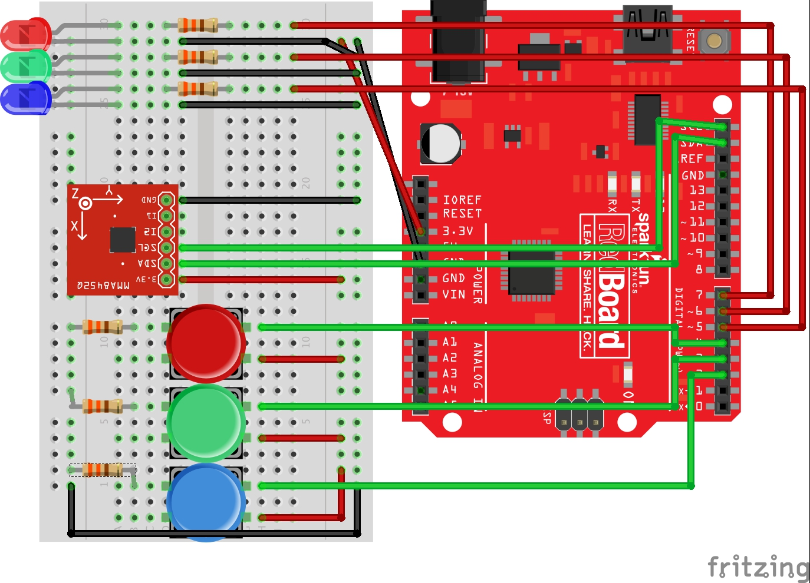
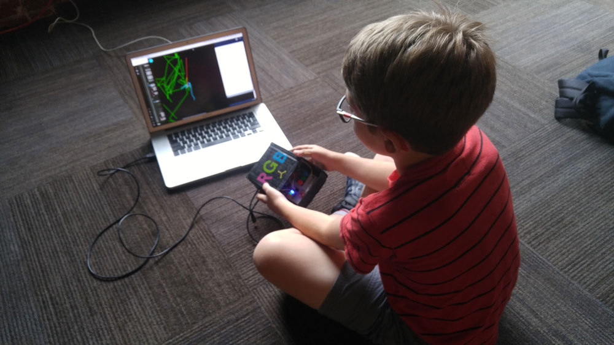
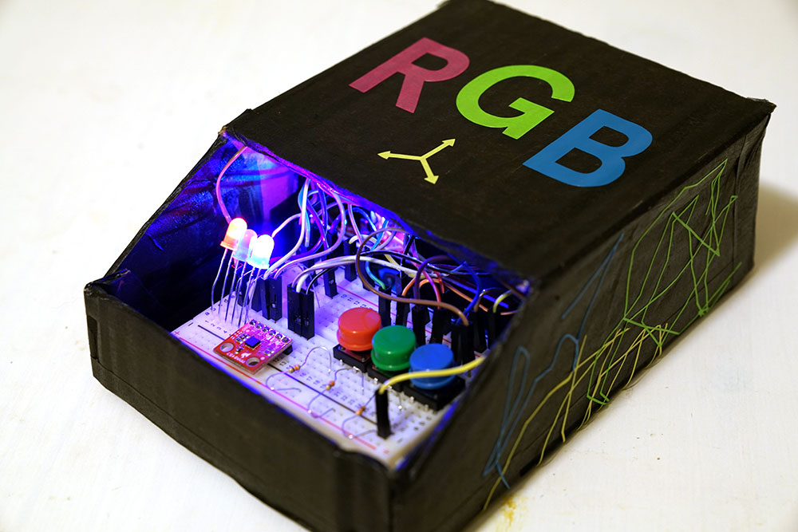
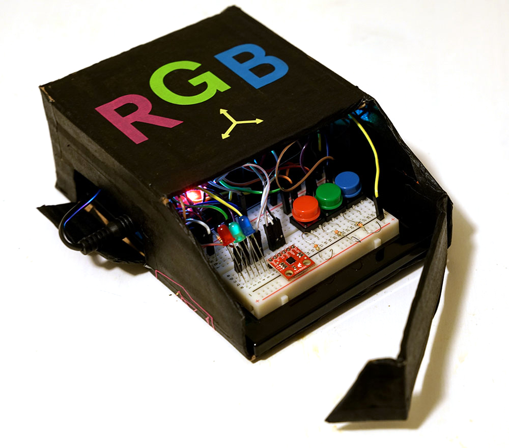
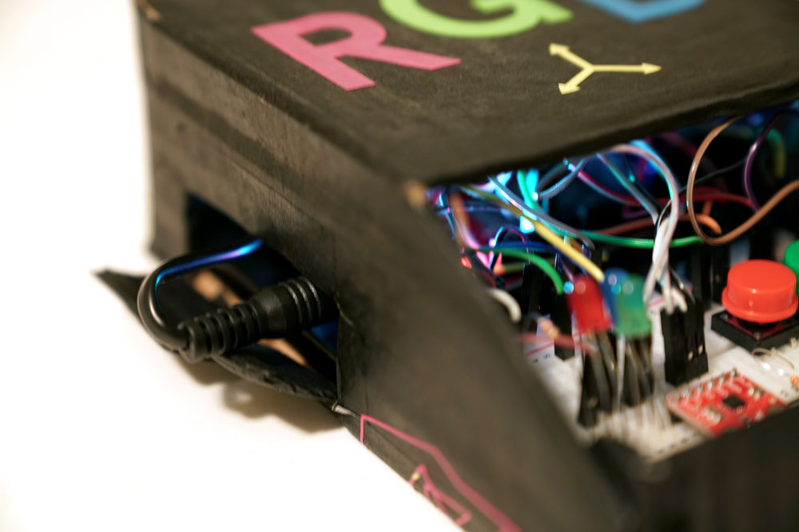
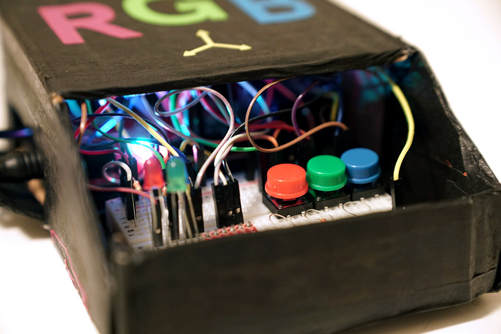
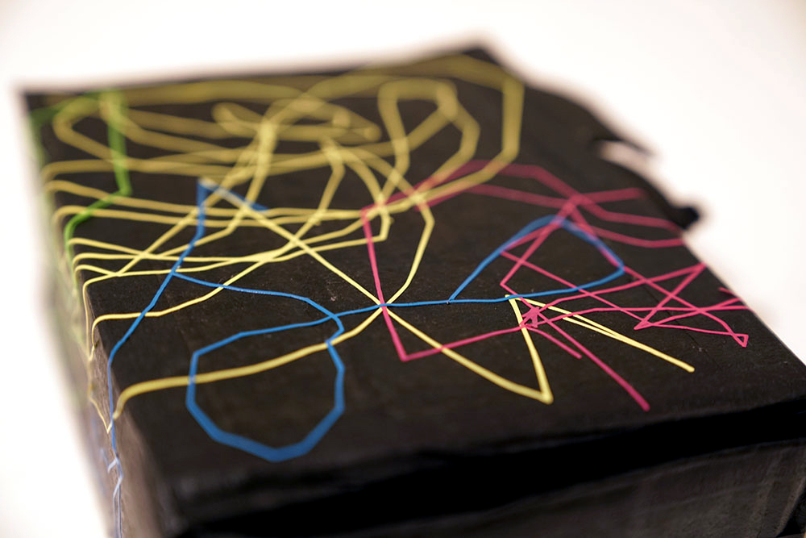
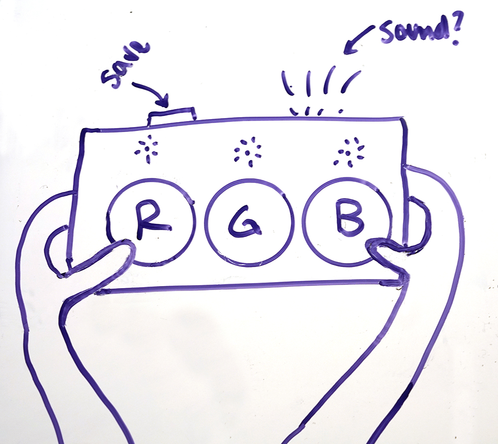

# Midterm IoT Project

Name: Sarah Riazati

Date: Thursday, October 12

## Project: RGB Game

### A drawing game...
**How to play:** RGB is a simple drawing game with a physical controller. The player can activate the red, green and blue buttons to adjust the color of the digital pen. The player moves the game controller in all directions to draw a line. The player can save the drawing by pressing the S key on the keyboard. 

#### ...with a twist? 

When a player presses S to save, the drawing game is paused and a footprint appears on top of the artwork. The overlaid footrprint containss messages about how much data the game received during playing, and how much data was created through the act of saving the work. 

	* You have been drawing for ___ seconds.
	* You have received approximately ____ bytes of data. 
	* You have created approximately ____ bytes of data. 

#### Why? 
RGB is a somewhat pointless game. You can't win, and it's nearly impossible to use the game to draw a realistic or intentional drawing. The experience of playing RGB may be enticing because of the unexpected interactivity of the DIY physical controller. Eventually, most players will grow bored of the novelty. Only after the gameplay is over will the player realize the true point of the game: even the most mindless digital activities receive and create data. Data travels on the infrastructure of the internet, which requires real, physical resources that come from the planet we all live on together.

#### Also... 

My Photon is listening for a message from my partner Rob's Photon. When my Photon hears the message "button pressed" in the "rob-sarah-physcomp-midterm-42" event, all of the buttons in the drawing game are automatically turned off. A button press on Rob's game sends data through his Photon to Blynk. To counteract this extra data, my Photon goes dark. 

## Technical details

### The Circuit

Start with a particle photon redboard wired like this:

The photon is collecting sensor data from the accelerometer and the three push buttons, for red, green and blue. Depending on which buttons are "on", the Photon turns on the corresponding LED, for feedback on the controller to show which colors are active. Together, this creates two separate, related systems: one for color picking and one for location sensing system. Information from each of these systems is pulled into an OSC message. The Processing sketch is listening for each of the messages, waiting to adjust the stroke color value and line positions accordingly. But more on that later!

### The Photon Code

#### The color picker 
In the photon code loop function, we read the signal from each button. If the button is pressed, we change the color's status (set to *false* by default) to the opposite. For example, when the green button is pressed, we do this toggle:

	        greenStatus = !greenStatus; 

And when the greenStatus = true, the corresponding LED turns on.

	        digitalWrite(greenLed, greenStatus); 

Most importantly, the photon code adds info to the OSC message depending on the color status. 

    		if (greenStatus) {
        		greenMessage = "GY";
    		} else {
        		greenMessage = "GN";
    		} 	

#### The accelerometer 

The accelerometer works based on the <a href="https://github.com/sparkfun/SparkFun_MMA8452Q_Particle_Library">SparkFunMMA8452Q library</a>. At the beginning of the code, we create an accelerometer object:
	
	MMA8452Q accel
	
In the set up function, we use the begin method and pass in parameters so it sends lots of data quickly, so we can draw a better line. 

    accel.begin(SCALE_8G, ODR_800); 

In the loop function, we read the accel data and write the float values of x, y and z into the OSC message.

    if (accel.available())
    {
        accel.read();
		
        outMessage.addFloat(accel.x);
        outMessage.addFloat(accel.y);
        outMessage.addFloat(accel.z);
    }

Now  we have constructed an OSC message with three strings (R,G,B) and three floats (x,y,z). We're ready to dive into Processing, where we'll take this info and make a drawing.

<a href="photon.ino">View the full photon code here.</a>

### The Processing Sketch

In Processing, we can grab the OSC message from the Photon and use the message's values to determine the stroke RGB color values, and the x and y positions to draw the line. 

We parse the OSC message and assign its messages into relevant variables, i.e. redIsOnMessage, xValue, etc.

	void oscEvent(OscMessage theOscMessage) {
    	if(theOscMessage.checkAddrPattern("/photon")==true){
  
    		redIsOnMessage = theOscMessage.get(0).stringValue();
    		greenIsOnMessage = theOscMessage.get(1).stringValue();
    		blueIsOnMessage = theOscMessage.get(2).stringValue();

    		xValue = theOscMessage.get(3).floatValue();    
    		yValue = theOscMessage.get(4).floatValue();    
    		zValue = theOscMessage.get(5).floatValue();
  
    		return;
  		}
	}

#### The Color Picker

In the draw loop, we use boolean values and conditional statements to check which buttons are on. For example, to check if we are receiving a message of "RY" (red is on) vs. "RN" (red is off):

	  String redIsOn = "RY"
      boolean isRedOn = redIsOnMessage.equals(redIsOn);
      
      if (isRedOn) {
        delay(delayTime);
        redValue = 255;  
     } 
      if (isRedOn == false) {
        delay(delayTime);
        redValue = 0;  
      }  
      
Then, we can use the updated redValue to change the stroke color and draw a circle of that color, for feedback:

  	stroke(redValue,greenValue,blueValue);

  	fill(redValue, greenValue,blueValue);
	ellipse(40,40,40,40);

      
#### The line

To draw the line, we take the float info now stored from OSC into xValue and yValue, and we use these messages to create a Floatlist to draw the line. *In future versions we could use z to do something too, or even cx, cy and cz (acceleration)*.

First, declare all the variables:
	
  	float posX;
    float posY;

    FloatList positionsX;
    FloatList positionsY;

    int listlengthX;
    int listlengthY;

    float currentX = screenWidth/2;
    float currentY = screenWidth/2;

    float prevX;
    float prevY;

In the setup loop, create the Floatlists:

    positionsX = new FloatList();
    positionsY = new FloatList();

In the draw loop, map the floats from the OSC message to bigger floats that better match the screen size. Append each new mapped position to the Float list, and measure the length of the list. Because we're using a list, we can always determine the ultimate and penultimate values in the float list, and we can use each of those as the *currentX*, *currentY*, *prevX* and *prevY* values that we need to draw a continuous line. 
  
    posX = map(xValue,-300,300,0,screenWidth);
    posY = map(yValue,-300,300,0,screenWidth);
    
    if (posX >= 0) {
      prevX = currentX;
      positionsX.append(posX);
      listlengthX = positionsX.size();
      currentX = positionsX.get(listlengthX-1);
    }
    if (posY >= 0) {
      prevY = currentY;
      positionsY.append(posY);
      listlengthY = positionsY.size();
      currentY = positionsY.get(listlengthY-1);
    }

    // now DRAW THE LINE
    line(currentX, currentY, prevX, prevY);

<a href="rgbgame/rgbgame.pde">View the full Processing code here.</a>

#### How does the game calculate my data? 

I used a timer to review the network usage of my Processing sketch via the Activity Monitor. I estimated that the Processing sketch receives roughly .2 KB of data / second via the OSC message from the Photon. So, there 6KB of data are transferred if a player plays for 30 seconds. 

What about the "data created" calculation? I used the timer info and the final image's file size of a group of 15 different images, and calculated an average game play time of 26.5 seconds, creating a file size average of 98.1 KB. 
	
	98.1 KB / 26.5 seconds = 3.7 KB / second

These calculations are both based on estimations. In future version of the game, I could determine more robust ways to calculate a player's specific impact, based on his/her actual drawing, instead of relying on averages. In the current version, since the drawings are saved locally on the laptop's hard drive,  the created data technically never "touches" the cloud. In a future version, the footprinted drawings would be automatically posted on a public social channel. 

#### Why not tell me more?   

The internet requires a massive infrastructure, and the full physical impact of the resources it requires to operate would be difficult to measure. For this reason, the final footprint succinctly points out that data was created and received, and the unexpected appearance of the footprint is sufficient surprise to trigger a memorable experience for the player. In a future version of the game, the data metrics that are revealed could even affect the success or function of the drawing game, i.e. less data creates a thicker line, or opens up more options for color, etc. 
 

## Conceptual background

>Is multi-tabbed browsing the IT equivalent of leaving the refrigerator door open?

Why is it so easy to forget that the electrical impact of internet browing spans far beyond the impact of charging a smartphone? Perhaps most web users don't have a full understanding of how the internet functions. I teach web design, and we always start off the unit with a discussion of how the internet works, why students need to purchase domain and hosting space, and what that really means. In these lessons, I try to emphasize that the internet relies on a physical infrastructur, which relies on electronics, which rely on electricity. 

So how does the web work? Let's follow an example, paraphrased from <a href="http://aceee.org/files/proceedings/2012/data/papers/0193-000409.pdf">The Megawatts behind Your Megabytes:</a> 

>An example transmission activity might begin on a desktop computer when an end user requests to download a song. That request gets converted into **packets** that are sent to their wireless router and then through a **fiber optic line** to a local **internet service provider (ISP)**, a Tier 3 **Point of Presence (POP)**. Once the ISP processes the packet, it sends it along, up to a **Tier 2 POP** through a fiber optic cable with more bandwidth. The packet with the request might then be passed up to a **Tier 1 POP** and shuttled across the country before hopping back down to a lower tier POP to find the **data center** where the song is stored... All of the sends and receives at the carrier nodes are brokered by **routers, switches, or hubs**; each humming with the electronics of their own processers and overhead loads such as cooling, power conditioning, and lighting.  Additionally, when fiber optic, copper-wire, or wireless communication links must span long distances, the signal degrades and must be regenerated periodically by **repeaters**, each of which adds to the energy footprint of the activities. Once the signal finally arrives at the data source, the download begins, sending the song in packets back to the original requester by way of the same process in reverse.
 
This same white paper projects that the average energy draw of worldwide internet is 141 billion kilowatt hours. Of that total, 38% of that load is on end user devices and 48% is from network data centers & servers. These projected numbers are from 2011, and have assuredly increased in the past 6 years.

In 2016, a report from the DOE's Lawrence Berkeley National Laboratory estimates that the US-based data centers used about 70 billion kilowatt hours. That's just the data centers in the United States alone! 

So, the internet takes up a lot of power to run. But how much data are we actually moving around as we browse, stream and download?  

A 2016 report from 
<a href="https://www.cisco.com/c/en/us/solutions/collateral/service-provider/visual-networking-index-vni/complete-white-paper-c11-481360.html?referring_site=RE&pos=1&page=https://www.cisco.com/c/en/us/solutions/collateral/service-provider/visual-networking-index-vni/mobile-white-paper-c11-520862.html#_Toc484813985">Cisco</a> reported the total consumer internet traffic to be 58,630 petbytes a month, or 703.56 exabytes a year. (1 petabyte is equal to 1 million gigabytes. 1000 petabytes equals 1 exabyte.) This number steadily increases year to to year. <a href="https://www.nytimes.com/2016/07/01/business/media/nielsen-survey-media-viewing.html">According to Nielsen</a>, the average American adult spends 10 hours 39 minutes a day consuming digital media in 2016, up one hour from 2015. 

### So are you saying I should stop Netflixing so much? 

Certainly not! With this project, my goal was to use game play to create a memorable experience that would bridge the disconnect between web browsing and environmental conservation movements. The transfer of data via the internet requires physical resources, like water, energy sources, hardware materials, and these resources are not unlimited, though the cloud might seem to be. So on one end, this project speaks to consumers and asks them to be mindful of the data they are moving around. 

On the other hand, while researching this project, I learned a lot about the role that IT giants like Google and Facebook have in dictating the future of public utilities like power companies. These tech giants have some sway, as they are a growing sector of the market for energy companies. Right here in North Carolina, in 2015 <a href="https://news.duke-energy.com/releases/duke-energy-google-team-up-on-solar-power-project-in-n-c">Google influenced Duke Power</a> to provide solar energy resources for its data center in Lenoir. From a business perspective, it's a smart move for Google to cut their electricity costs as much as possible by relying on less expensiove, more reliable forms of energy (i.e. not fossil fuels). It's also a good PR move: Greenpeace's <a href="http://www.clickclean.org/usa/en/about/">Click Clean</a> campaign calls on major internet companies to move away from "dirty" energy. In 2017, Greenpeace gave Facebook and Google an A rating, while Netflix got a D - Netflix works on AWS, and Amazon has been tightlipped about their energy sources. So, should you stop Netflixing so much? That's up to you! 

 
### What about all the web browsing *you* did to make this project? 
 
I reviewed my browsing history and estimated the number of sites I visited to research my project. Using the time stamps, I was also able to estimate the amount of time spent researching so far. Until Monday 10/9 at 5PM, I spent nearly 9 hours online for this project, visiting **nearly 600 websites**, and that was still three days before the deadline! My conservative estimate for browsing habits is that I visited just over 1 site / minute, on average. <a href="http://www.httparchive.org/interesting.php?a=All&l=Sep%2015%202017">According to the HTTP Archive</a>, the average size of a website is 3.376 MB.

	3376 kb * 600 sites = 2025600 kb total 

That's just over 2GB in data downloaded to research and build this prototype, and it's is a conservative estimate. It does not account for data *sent* from my computer to other servers, and it doesn't account for the weight of streaming video tutorials (thanks <a href="https://www.youtube.com/user/shiffman">Coding Train!</a>). That's a lot of data!
 

## Form & Enclosure 

RGB Game lives inside a recycled cardboard box. In designing the enclosure, I considered using digital fabrication methods or purchasing materials from the Scrap Exchange, but in the end, I thought it was a better conceptual fit to work with materials that I already owned. I created my own vinyl stickers for labels, and used actual drawings from the game as decorative elements.

In this prototype, the electronics are visible and it's possible to remove/replace the Photon & breadboard without destroying the enclosure. 

### What's next? 

In a future version of this project, I would ditch the breadboard and embed the buttons and LEDs directly in the enclosure. I would add an additional button for starting / saving / resetting the game, to replace the need for keyboard presses. I might even add in a speaker, so the game could play a varying tone based on information from the accelerometer! 

Here are some other things I would continue to improve: 

* Automatically post each final, overlaid drawing from Processing to a Flickr account
* The caption of the Flickr image would include further information about energy sources, based on the geo-location of the post
* The caption could also include personalized, specific information about the projected water usage, pollution and hardware resources for your gameplay
* Create more experimental games and interactive experiences that coudl combine into a collection exploring the materials behind the cloud

